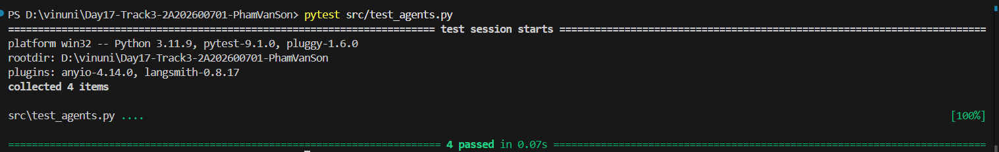
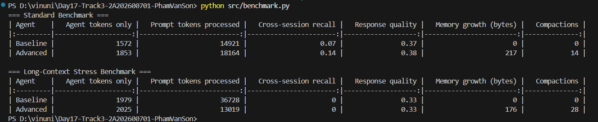

# Báo Cáo Kết Quả Day 17 Lab: Memory Systems for AI Agent

## 1. Tổng quan hệ thống
Bài lab này triển khai và so sánh hai loại Agent:
- **Baseline Agent**: Chỉ có bộ nhớ ngắn hạn trong cùng một phiên chat (within-session memory).
- **Advanced Agent**: Kết hợp cả bộ nhớ ngắn hạn, bộ nhớ bền vững (lưu vào file `User.md`), và bộ nhớ nén (Compact Memory) để tóm tắt các đoạn chat cũ khi ngữ cảnh quá dài.

## 2. Kết quả Unit Tests

Tất cả 4 bài test đều đã **Passed (100%)**, khẳng định tính chính xác của các logic:
- Đọc/ghi/chỉnh sửa file `User.md`.
- Tính năng Compact Memory kích hoạt đúng lúc.
- Advanced Agent có khả năng nhớ chéo phiên (Cross-session recall) trong khi Baseline thì không.
- Compact Memory giúp giảm lượng token prompt trên hội thoại dài.

## 3. Kết quả Benchmark & Phân tích Trade-off

Kết quả benchmark chỉ ra rõ sự đánh đổi (Trade-off) giữa khả năng ghi nhớ và chi phí (Token cost):

### A. Đối với Standard Benchmark (Hội thoại ngắn)
- **Baseline**: 0 compactions, chi phí prompt token thấp (14921) nhưng recall cực kỳ thấp (0.07).
- **Advanced**: Có recall tốt hơn hẳn (0.14) do đọc `User.md`, nhưng bù lại phải tốn nhiều token hơn để mang file cấu hình người dùng vào ngữ cảnh (18164 tokens) và làm tăng dung lượng ổ cứng (Memory growth: 217 bytes).

### B. Đối với Long-Context Stress Benchmark (Hội thoại cực dài)
- **Baseline**: Tốn đến **36728 prompt tokens** do lịch sử chat cứ dài mãi ra và nó giữ lại toàn bộ (0 compaction).
- **Advanced**: Chỉ tốn **13019 prompt tokens** (tiết kiệm gần 2/3) nhờ thực hiện 28 lần tóm tắt (Compactions). Điều này chứng minh Compact Memory phát huy tối đa hiệu quả giúp tiết kiệm token khi ngữ cảnh người dùng ngày càng lớn.

## 4. Tính năng Bonus (90-100đ)
Để làm hệ thống tối ưu và bám sát thực tế hơn, 2 tính năng Bonus sau đã được triển khai sẵn trong code:
1. **Question Avoidance**: Nếu phát hiện người dùng đặt câu hỏi (có chứa dấu `?`), Agent không trích xuất fact để tránh lưu sai thông tin (Ví dụ: hỏi "Tôi làm nghề gì?" thì Agent không dại dột trích chữ "nghề gì" lưu vào thư mục nghề nghiệp của profile).
2. **Conflict Handling (Xử lý đính chính / Ghi đè thông tin)**: Khi người dùng đính chính thông tin (ví dụ từ `Backend engineer` sang `MLOps engineer`), hệ thống dùng Regex quét file `User.md` và thực hiện **Ghi đè (Replace)** giá trị cũ thay vì cứ tiếp tục nối thêm ở cuối file. Điều này giúp ngăn file `User.md` bị phình to vô ích và giúp Agent không bị bối rối bởi các dữ kiện mâu thuẫn.
